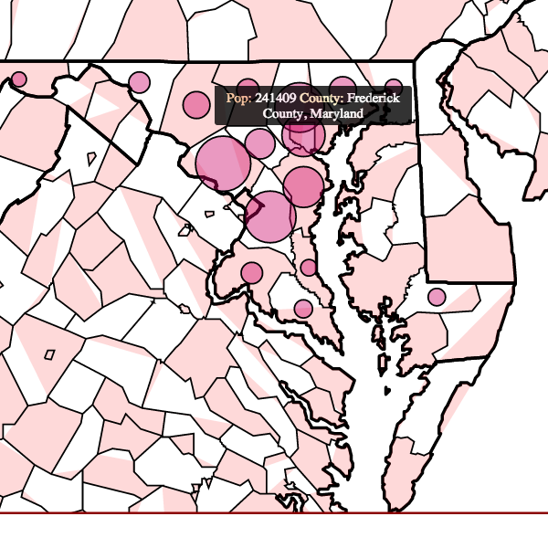
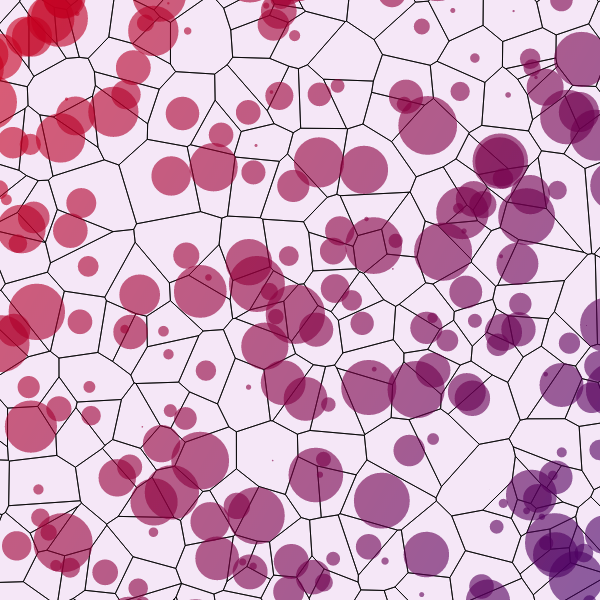
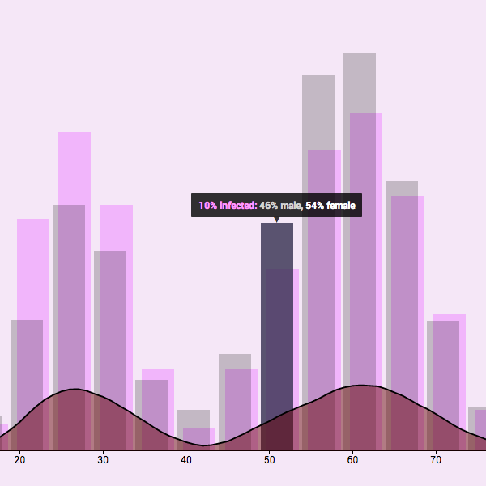

I have worked on several projects using the `D3js` library for visualization and interactivity. The header of this page (above) is a visualization of a quicksort algorithm based on `HEX` color values. These projects include geographical mapping (GIS), Voronoi diagrams, and visualizing disease within a populations where metadata could be extremely important.

#### Mapping Populations

<figure>
	
	<figcaption><a href="" title="County Population Sizes of Maryland">County Population Sizes of Maryland</a>.</figcaption>
</figure>

Using census data, I created an interactive map of the state of Maryland. The circles within each county represent relative population size at a given year. The user can click between multiple years - making the map re-create the circles based on the specified year's census data. As shown in this figure, county metadata is shown as a tooltip (mouse over event).  

#### Voronoi

Voronoi diagrams are an interesting way to visualize the self-assemblage of territories within a population. I like to think of these diagrams as a way to see how randomly assorted points in a Euclidean landscape with high repulsion (i.e. they do not want to be around each other) can create an interesting map of territories with no higher-order rules governing the behavior.  

With randomly generated points you may something that looks like this:

<figure>
	
	<figcaption><a href="" title="Interactive Voronoi to Visualize Spatial Chaos">Interactive Voronoi to Visualize Spatial Chaos</a>.</figcaption>
</figure>

#### Diseased Populations

One of the most important aspects of analysis is really just visualizing data. Here I took a randomly created population of people with various ages and disease propensities. Then I subsampled this population for the simulated `sample population`. Using a `Kernel Density Estimation` and tooltips, I created histograms of both the sample and "real" populations along with a probability surface for individuals to have the disease.  

<figure>
	
	<figcaption><a href="" title="Using Interactivity to Visualize Hidden Metadata Within a Population">Using Interactivity to Visualize Hidden Metadata Within a Population</a>.</figcaption>
</figure>
