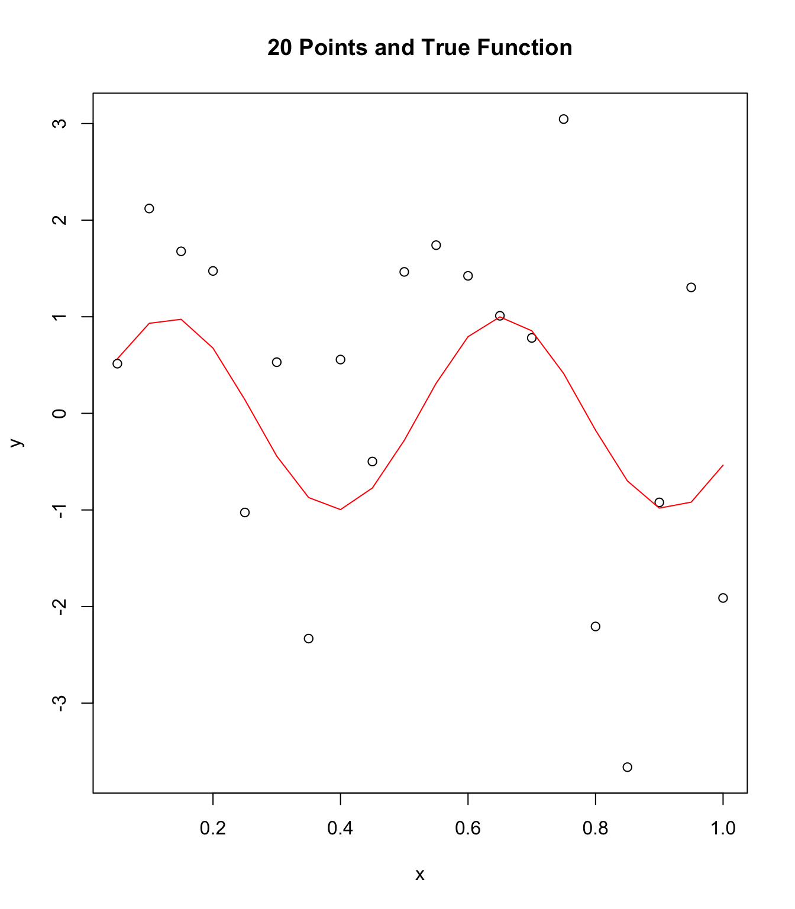
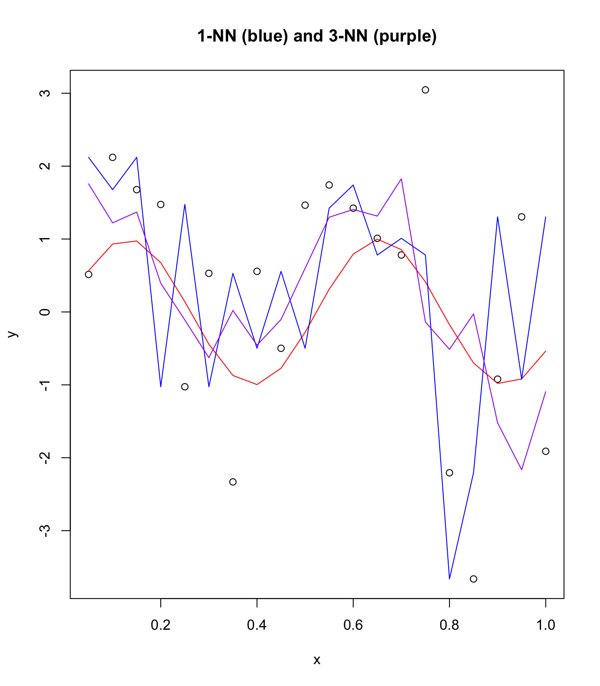
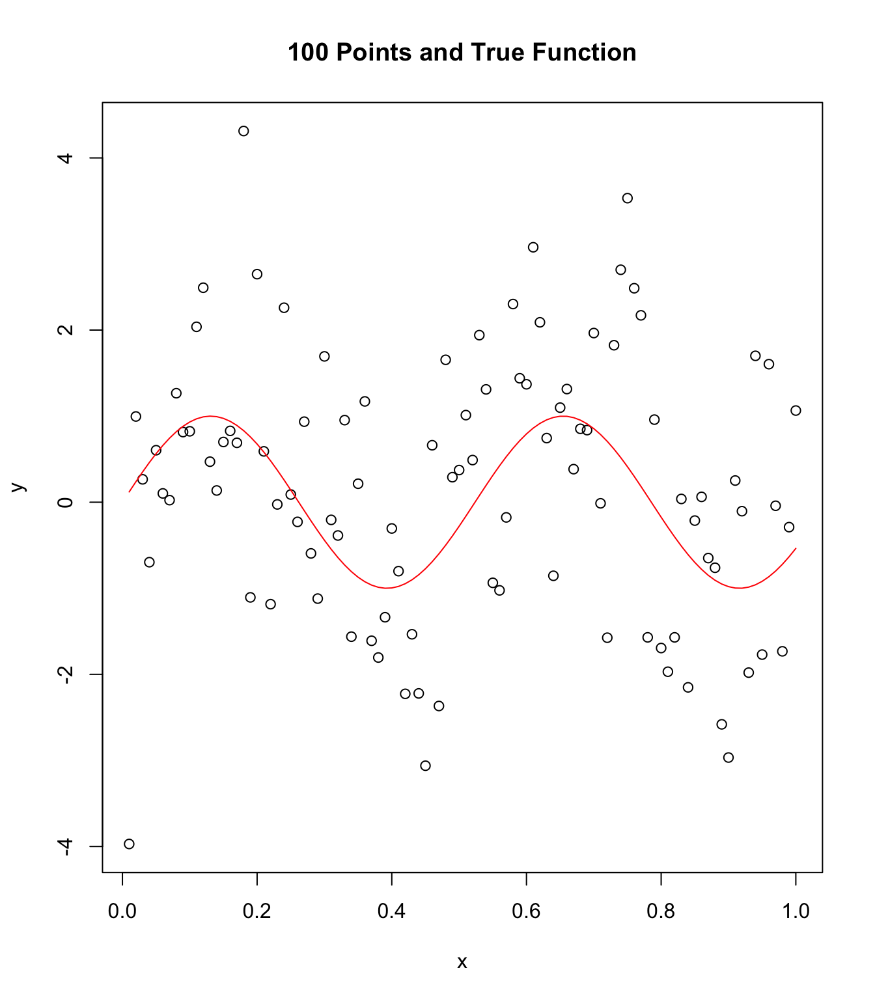
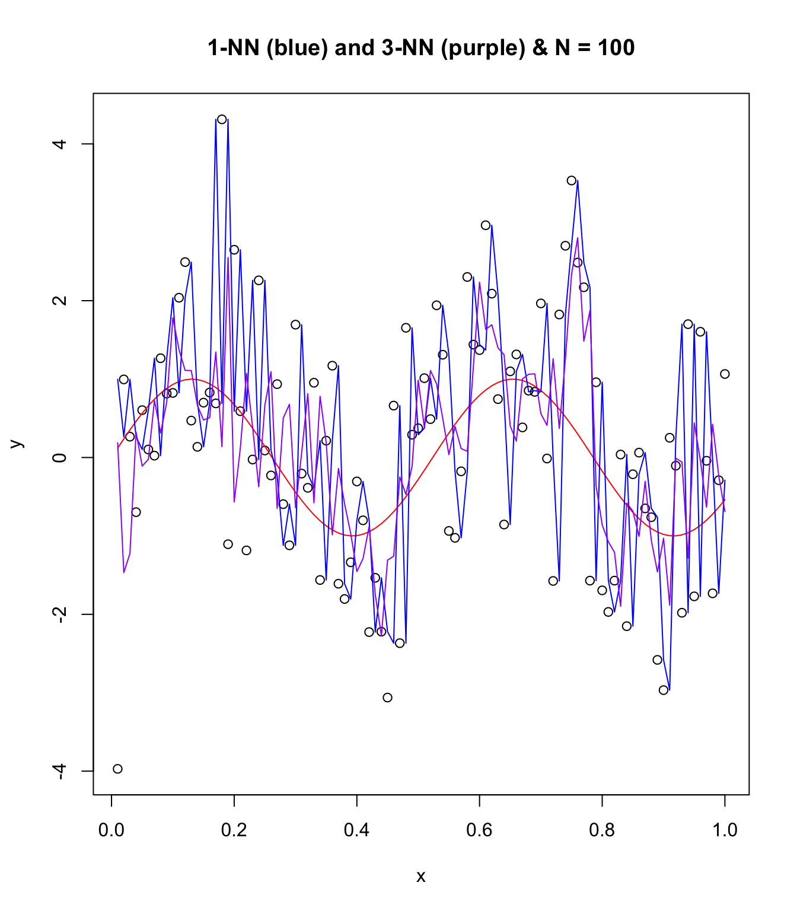
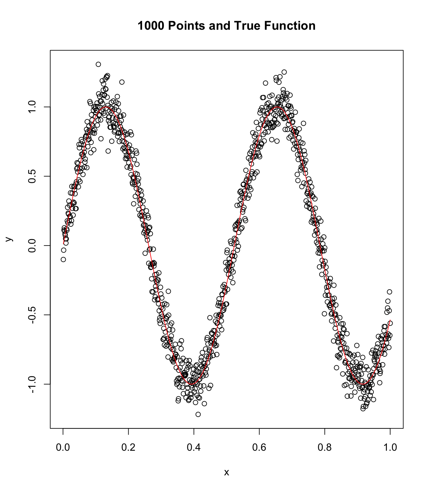
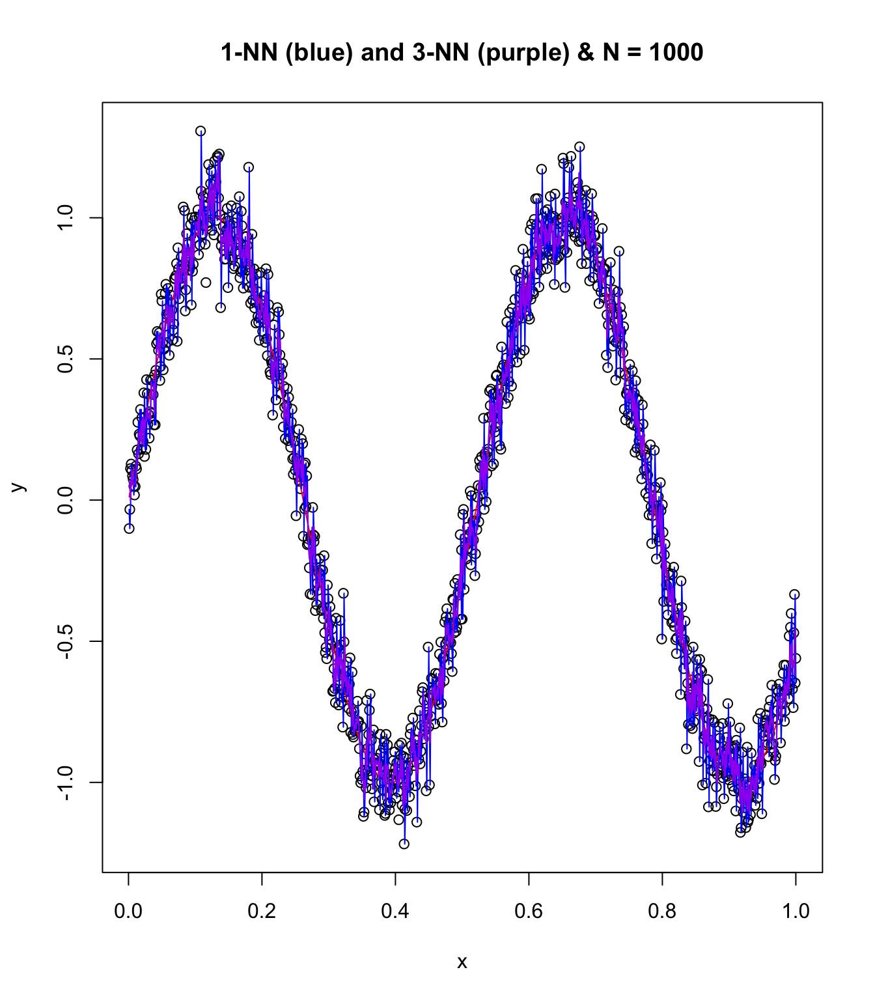
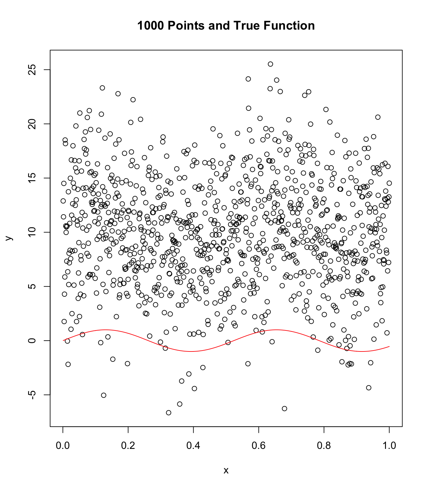
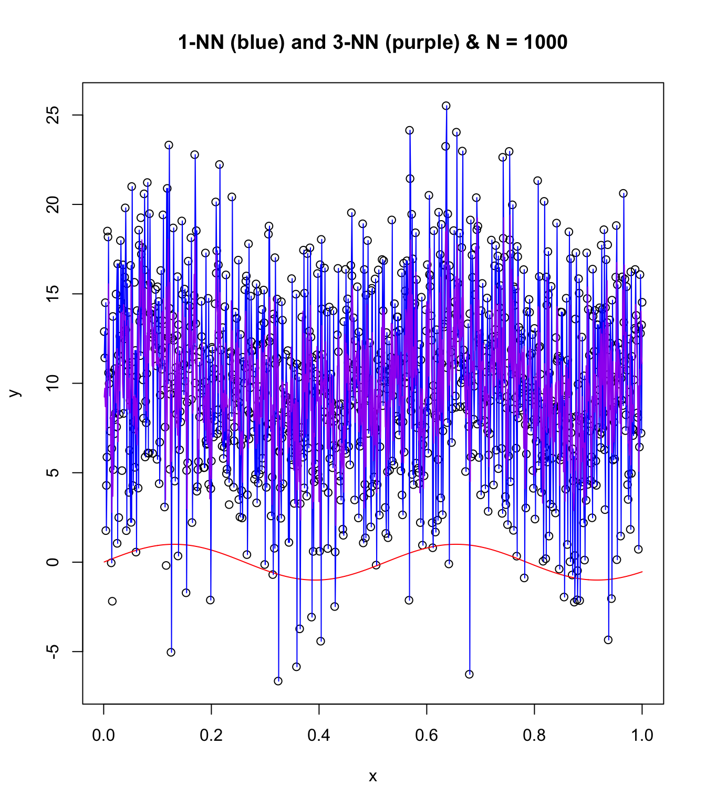

How does k-nearest neighbor methods change with sample intensity, variance,
and noise? Let's check it out using <strong>R</strong>:

Due to low sample size (i.e. <code>N = 20</code>) and high influence of error noise
from standard deviation this data looks nearly chaotic rather than
following the function <code>sin(12x)</code>. Next we look at 1-Nearest Neighbor
(NN) and 3-NNs on this N = 20 plot. We can see that 3-NNs does somewhat
better at fitting the true function than 1-NN using a brute approach.
Using a larger sample size would probably greatly improve predictions
of k-NNs.  

Predictive analysis and machine learning algorithms have a constant
tradeoff between bias and variance. On one hand, a 1-NN would perfectly
fit all points within the dataset but would lack robust and generalized
abilities for future data. This would leave extremely high bias
with no variance. On the contrary, when we approach infinity-NN we have
nothing fitted. With this case we approach no bias and infinite variance.
These principles apply when we examine the number of NNs used in this problem
from 1 to 3 to 10 and onwards.

In addition, when increasing sample size from <code>N = 20</code> to
<code>N = 100</code> to <code>N = 1000</code>,
we begin to get a better representation of the population data. In
this case the population is abstract though the concept of us pulling
from some pool of points in order to create our data with noise holds.
Increasing sample size allows noise to be averaged into "true" data fit.
This is seen in the reduction of power outliers have on the mean of
the data as sample size increases as well as the visually smooth nature
of NN plots.

Changing the variance within the random number draws of the error terms
(i.e. noise) will linearly increase the average amount of noise for each
point. This can be understood as follows: increasing the variance of the
normal distribution with the same mean will change the spread of the
probability density function. Variance approaching 0 will result in the
same random value (equal to the mean) drawn. Variance approaching infinity
will result in an equal probability that the random number is any number
(-infinity to infinity).

#### Create sample data and true function

```
x <- seq(1:20) / (20)
numN <- length(x)
meann <- 0
stddev <- 0.1
y <- sin(12 * x) + 1.3 * rnorm(numN, stddev)
```

#### Visualize 1-NN and 3-NN:

```
plot(x, y, main = "20 Points and True Function")
points(x, sin(12 * x), col = "red", type = "l")
```

<figure>
	<a href="../images/feb22-knn/n20.jpg"></a>
	<figcaption><a href="" title="Low sample size and high variance">Low sample size and high variance</a>.</figcaption>
</figure>

#### Now try K-NNs with 1 and 3.

```
library(FNN)
df <- data.frame(x)
knn1 <- knn.reg(df, test = NULL, y, k = 1, algorithm = "brute")
knn3 <- knn.reg(df, test = NULL, y, k = 3, algorithm = "brute")
```

```
plot(x, y, main = "1-NN (blue) and 3-NN (purple)")
points(x, sin(12 * x), col = "red", type = "l")
points(x, knn1$pred, type = "l", col = "blue")
points(x, knn3$pred, type = "l", col = "purple")
```

<figure>
	<a href="../images/feb22-knn/n20knn.jpg"></a>
	<figcaption><a href="" title="Low sample size and high variance with K-NN">Low sample size and high variance with K-NN</a>.</figcaption>
</figure>

## Repeat with N = 100:

```
x <- seq(1:100) / (100)
numN <- length(x)
meann <- 0
stddev <- 0.1
y <- sin(12 * x) + 1.3 * rnorm(numN, stddev)
```

#### Visualize 1-NN and 3-NN:

```
plot(x, y, main = "100 Points and True Function")
points(x, sin(12 * x), col = "red", type = "l")
```

<figure>
	<a href="../images/feb22-knn/n100.jpg"></a>
	<figcaption><a href="" title="Mid. sample size and high variance">Mid. sample size and high variance</a>.</figcaption>
</figure>

#### Now try K-NNs with 1 and 3.

```
df <- data.frame(x)
knn1 <- knn.reg(df, test = NULL, y, k = 1, algorithm = "brute")
knn3 <- knn.reg(df, test = NULL, y, k = 3, algorithm = "brute")
```

```
plot(x, y, main = "1-NN (blue) and 3-NN (purple) & N = 100")
points(x, sin(12 * x), col = "red", type = "l")
points(x, knn1$pred, type = "l", col = "blue")
points(x, knn3$pred, type = "l", col = "purple")
```

<figure>
	<a href="../images/feb22-knn/n100knn.jpg"></a>
	<figcaption><a href="" title="Mid. sample size and high variance with K-NN">Mid. sample size and high variance with K-NN</a>.</figcaption>
</figure>

## Repeat with N = 1000, lower noise, and fun!

```
x <- seq(1:1000) / (1000)
numN <- length(x)
meann <- 0
stddev <- 0.1
y <- sin(12 * x) + 0.1 * rnorm(numN, stddev)
```

#### Visualize 1-NN and 3-NN:

```
plot(x, y, main = "1000 Points and True Function")
points(x, sin(12 * x), col = "red", type = "l")
```

<figure>
	<a href="../images/feb22-knn/fun.jpg"></a>
	<figcaption><a href="" title="High sample size and low variance">High sample size and low variance</a>.</figcaption>
</figure>

#### Now try K-NNs with 1 and 3.

```
df <- data.frame(x)
knn1 <- knn.reg(df, test = NULL, y, k = 1, algorithm = "brute")
knn3 <- knn.reg(df, test = NULL, y, k = 3, algorithm = "brute")
```

```
plot(x, y, main = "1-NN (blue) and 3-NN (purple) & N = 1000")
points(x, sin(12 * x), col = "red", type = "l")
points(x, knn1$pred, type = "l", col = "blue")
points(x, knn3$pred, type = "l", col = "purple")
```

<figure>
	<a href="../images/feb22-knn/funknn.jpg"></a>
	<figcaption><a href="" title="High sample size and low variance with K-NN">High sample size and low variance with K-NN</a>.</figcaption>
</figure>

## Repeat with N = 1000, higher noise, and chaos!

Some funny things are happening here!

```
x <- seq(1:1000) / (1000)
numN <- length(x)
meann <- 0
stddev <- 2.0
y <- sin(12 * x) + 5.0 * rnorm(numN, stddev)
```

#### Visualize 1-NN and 3-NN:

```
plot(x, y, main = "1000 Points and True Function")
points(x, sin(12 * x), col = "red", type = "l")
```

<figure>
	<a href="../images/feb22-knn/chaos.jpg"></a>
	<figcaption><a href="" title="High sample size and high variance">High sample size and high variance</a>.</figcaption>
</figure>

#### Now try K-NNs with 1 and 3.

```
df <- data.frame(x)
knn1 <- knn.reg(df, test = NULL, y, k = 1, algorithm = "brute")
knn3 <- knn.reg(df, test = NULL, y, k = 3, algorithm = "brute")
```

```
plot(x, y, main = "1-NN (blue) and 3-NN (purple) & N = 1000")
points(x, sin(12 * x), col = "red", type = "l")
points(x, knn1$pred, type = "l", col = "blue")
points(x, knn3$pred, type = "l", col = "purple")
```

<figure>
	<a href="../images/feb22-knn/chaosknn.jpg"></a>
	<figcaption><a href="" title="High sample size and high variance with K-NN">High sample size and high variance with K-NN</a>.</figcaption>
</figure>
