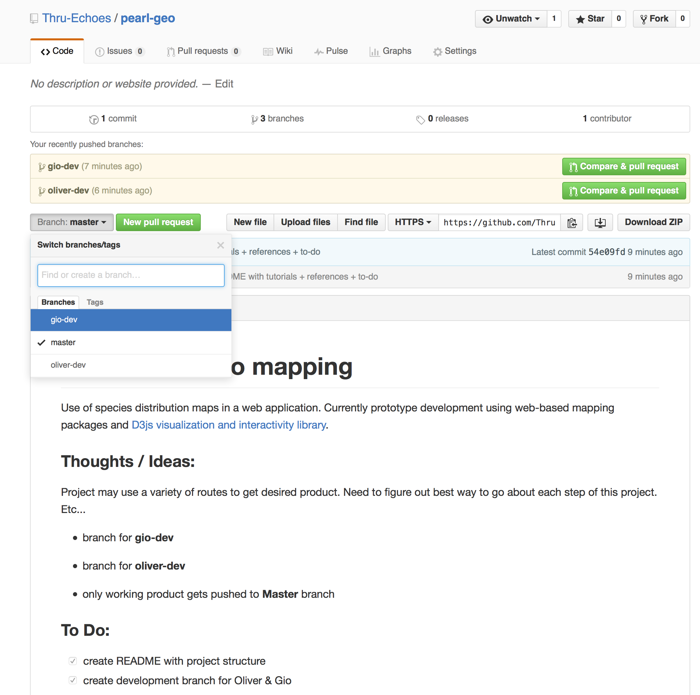

# How to use Git

Version Control in the command-line (Terminal) with a focus on UNIX based systems. I am not sure how these things translate over to Windows machines. I am putting these up through the use of a OS X (Apple) machine but they are almost identical to Linux systems.

#### A few points:

* Command-Line in OS X is used in Terminal which can be found under <code>/Applications/Utilities/Terminal</code>
* anything with a <strong>$</strong> symbol before it represents Command-Line code
* directories are what your "folders" are (from Finder or some other file search software that you use by click-and-point)
* <strong>dir</strong> = directories for short
* <strong>repo</strong> = respository for short = place where the project / code lives and we are using git to communicate with

## Step-by-step

#### Step 1a: Initialize Repository

If there is a repository online (like on Github) you need to initially clone it unto your machine.

```
    $ git clone https://github.com/GITHUB_USERNAME/REPO.git
```

<figure>
	<a href="../images/april11-git/step1-clone-repo.png"></a>
	<figcaption><a href="" title="Clone repository to your machine">Clone repository to your machine</a>.</figcaption>
</figure>

#### Step 1b: Pull in Repository

If you already have the repo you need to pull in any changes that may have happened since you last used it.

```
    $ git pull origin BRANCH
```

<strong>BRANCH</strong> refers to whatever branch of the repo you are working from. All repos start with Master. So instead of "BRANCH" you would write "master". However, you may be working off of a development branch...switch the word "BRANCH" accordingly.

#### Step 1c: Set up remote origin

Using git with something like github is interesting. It is easy to not realize or forget the difference but git is its own software / tool. Github uses git. But git is the actual keystone tool in this process.

You can keep using git for whatever you want to keep track of through version control on your local machine. Things do not go to github unless you push to them explicitly. Again, git is not naturally or exclusively linked to github. You link git to github by establishing a <strong>remote</strong> repository 'connection'.

<strong>NOTE:</strong> this is not necessary and you usually do not need to do this. But it is important to understand what is happening.

Here are some cases / situations where we may want to do the following:
a. If you have a local project that you have been using git for (all locally) and then decide you want to connect it to a github repository (or some other repository)

b. something is not correct about your current connection to the repository and you need to 're-connect' it

c. you want to re-assign where and what repository you are connecting to  

```
    $ git remote origin https://github.com/GITHUB_USERNAME/REPO.git
```

This will establish a connection called <strong>origin</strong> to the url written there.

If it says that <strong>origin is already established / in use</strong> you can set up another alias for the connection:
```
    $ git remote new-alias https://github.com/GITHUB_USERNAME/REPO.git
```

With this new alias you can push and pull changes like so (this is described below):

```
    $ git pull new-alias my-new-branch
    ...
    $ git push new-alias my-new-branch
```

#### Step 2a: Go into the repo dir

Go into the repository directory.

<strong>NOTE:</strong> this step would happen BEFORE trying to pull or push.

```
    $ ls
    # this shows everything that is in your current dir (including new clone repo)
    $ cd THE-REPO-DIR
```

<figure>
	<a href="../images/april11-git/step2-see-repo.png"></a>
	<figcaption><a href="" title="See everything in your directory">See everything in your directory</a>.</figcaption>
</figure>

<hr>

<figure>
	<a href="../images/april11-git/step3-go-into-repo.png"></a>
	<figcaption><a href="" title="Go into the repo dir">Go into the repo dir</a>.</figcaption>
</figure>

#### Step 2b: Switch Branches

Perhaps you want to make a new branch for development. You can call it <strong>my-dev-branch</strong>.

```
    $ git branch my-dev-branch
    $ git checkout my-dev-branch
```

The first line creates the branch and the second one puts you into it.

<figure>
	<a href="../images/april11-git/step5-a-switch-branch-and-pull.png"></a>
	<figcaption><a href="" title="Create and switch branches">Create and switch branches</a>.</figcaption>
</figure>

<strong>NOTE:</strong> creating a new branch ALWAYS branches off from the exact location you are now (exact location of your current branch). In other words, <strong>my-dev-branch</strong> is not an empty branch - instead it contains whatever you had going on in the branch it came from. Think about it like a tree. That is why it is called BRANCHING!  

#### Step 3: Check your Branch Status

This should report something about the branch <strong>my-dev-branch</strong> in Terminal.

```
    $ git status
```

<figure>
	<a href="../images/april11-git/step4-get-status.png"></a>
	<figcaption><a href="" title="Get status of repo">Get status of repo</a>.</figcaption>
</figure>

#### Step 4: Make changes to your files

However you do it - whatever text editor - whatever method: make some changes. For point of illustration, I will use changes to a file called <strong>README.md</strong> and another file called <strong>other-readme.md</strong> that is within a dir called <strong>this-dir</strong>.

```
    # README.md
    # this-dir/other-readme.md
```

#### Step 5: Queue changes, commit message / description

After changes we need to queue up and then include a message describing what changes we have made.

```
    $ git add README.md
    $ git add this-dir/other-readme.md
    $ git commit -m "I made changes to the README and this-dir/other-readme files"
```

#### Step 6: Push changes to the repo

This is the final step of basic git usage. This is how we actually push our changes to the repository so the world can see it. Remember, each commit / push is like taking a screenshot of your project that is tagged with a date, unique id, and the message you had wrote with <code>git commit -m "A MESSAGE HERE"</code>. Screenshots can always be reverted to - a powerful and beautiful aspect of the tree structure of git.

```
    $ git push origin my-dev-branch
```

<hr>

And now we can see what it looks like on Github!

<figure>
	<a href="../images/april11-git/step5-b-switch-branch.png"></a>
	<figcaption><a href="" title="See branches on Github">See branches on Github</a>.</figcaption>
</figure>
